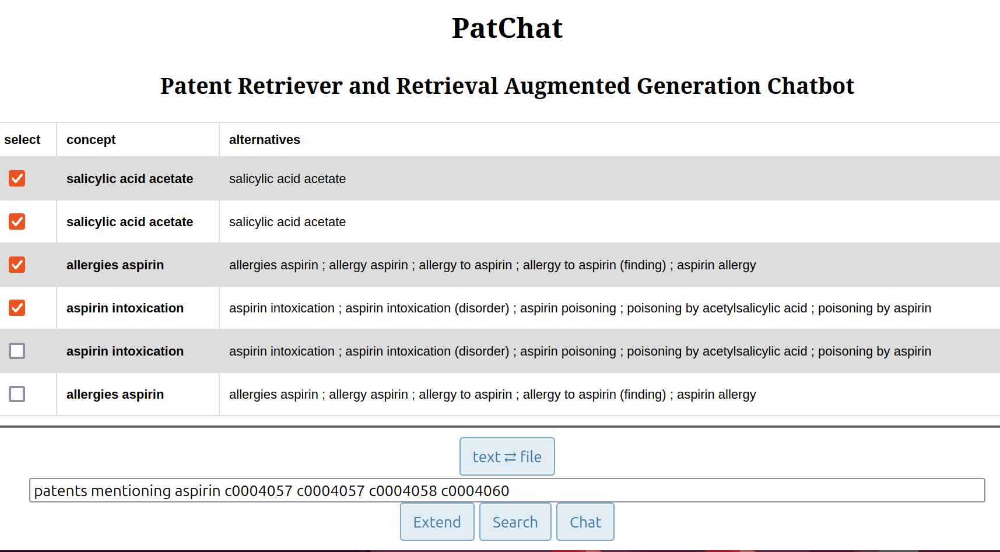

# User Guide and insights
Once the flask server is active and waiting for requests (see [INSTALL.md](./INSTALL.md) if required, open a web brower at:
[http://127.0.0.1:5000/](http://127.0.0.1:5000/)
)
Your should see :
.

## Query and actions (summary)
- You're current input is a text query. You can swith to a file query by clicking the "text ⇄ file" button :

You can type your query in the text field and click on one of the 3 available buttons :
1. Extend: get a selection of medical concepts that you might want to append to your query
2. Search: get a selection of patents that you might want to provide to the chatbot.
3. Chat : Chat with PatChat. 

## Query expansion

The "Extend" button triggers :
1. The query, that may be a query string or a text file that will be automatically transformed into a sentence embedding vector of 781 dimensions. Note for noobs : it is a sort of __semantic__ representation of words or sentences. Occurences of identical words might be represented by different vectors, depending on the context of occurence. 
2. The system performs a k-nearest neighbors (KNN) search into the UMLS concept vector database. So it retrieves the medical concepts that are __semantically__ the closest to the query.
3. The retrieved concepts are displayed and can be added to the text query, as concept IDs, by ticking the associated checkboxes. 

4. These concepts and their various textual forms improve the precision and recall of a following patent search. Their are ignored if the user jumps directly to chat.

## Patent retrieval

## Chatbot
